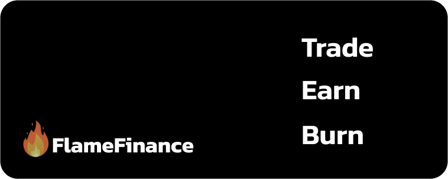

# FlameFinance


FlameFinance is the Most Promising Decentralised Exchange on Core Chain.

**Trade, Earn, and Burn.**


## ↔️ Trade

> Swap Core Tokens in an instant no hassles no KYC needed.

### The Core Community choice

FlameFinance is the Leading Decentralise Exchange on Core Chain.

### Low fees

FlameFinance Runs on CoreChain The most Cheapest Blockchain among Others when it Comes to Transactiob Fees.\
Trading fees are lower than other top decentralized exchanges too.!

### Decentralized

Trade directly from your wallet app.\
FlameFinance doesn’t hold your funds when you trade: **you have 100% ownership of your own crypto**.

## 💸 Earn

> Earn FLAME and other tokens for free with super high interest rates.

### Earn tokens with Flame Pools

Stake FLAME, earn free tokens. It’s really that easy.\
FLAME holders right now are earning tens of millions of USD worth of free tokens each week from major projects. New projects join the party frequently, so you can earn more, for even longer.

### Earn FLAME with Yield Farms

Stake LP tokens, earn FLAME. You take on a little more exposure to market fluctuations than with the FLAME Pools, but can earn higher APR to offset the risk.

### Earn Trading Fees

No farm? No problem. Even if your trading pair isn’t supported on the Farms page, you can still earn trading fees when you stake your tokens in Liquidity Pools (LPs).

### NFT Collectibles

Win collectible NFTs for participating in trading competitions and more fun & games.

## Is FlameFinance safe?

See for yourself:

* Check out this FlameFinance Have Successfully Verified KYC with CoreDao Team:
  *
* Transparent:
  * We’re built on open-source software: our site and all our Smart Contracts are publicly visible for maximum transparency.
  * Our contracts are verified on BscScan so you know that what you see is what you get: [1](https://bscscan.com/address/0x10ED43C718714eb63d5aA57B78B54704E256024E) [2](https://bscscan.com/address/0x73feaa1ee314f8c655e354234017be2193c9e24e#code) [3](https://bscscan.com/address/0xbcfccbde45ce874adcb698cc183debcf17952812) [4](https://bscscan.com/address/0x1b96b92314c44b159149f7e0303511fb2fc4774f#code) [5](https://bscscan.com/address/0x92E8CeB7eAeD69fB6E4d9dA43F605D2610214E68)
* Security best practices:
  * The chefs use multisig for all contracts.
  * Our contracts’ time-locks give you peace of mind.

**Sounds like fun?**\
**Then get flipping!** 🐰 🥞

***
